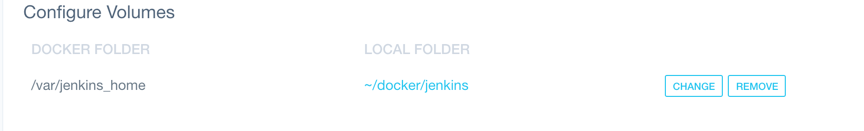

# vue-jenkins

#docker - jenkins 安装
先创建目录/Users/truexin/docker/jenkins，
用于映射docker里面的/var/jenkins_home内的文件

```bash
docker pull jenkins/jenkins
```
#docker - jenkins 启动
```bash
docker run -d -p 8080:8080 -p 50000:50000 --name jenkins --privileged=true -v /Users/truexin/docker/jenkins:/var/jenkins_home jenkins/jenkins
```

> A Vue.js project

## Build Setup

``` bash
# install dependencies
npm install

# serve with hot reload at localhost:8080
npm run dev

# build for production with minification
npm run build

# build for production and view the bundle analyzer report
npm run build --report

# run unit tests
npm run unit

# run e2e tests
npm run e2e

# run all tests
npm test
```

For a detailed explanation on how things work, check out the [guide](http://vuejs-templates.github.io/webpack/) and [docs for vue-loader](http://vuejs.github.io/vue-loader).
